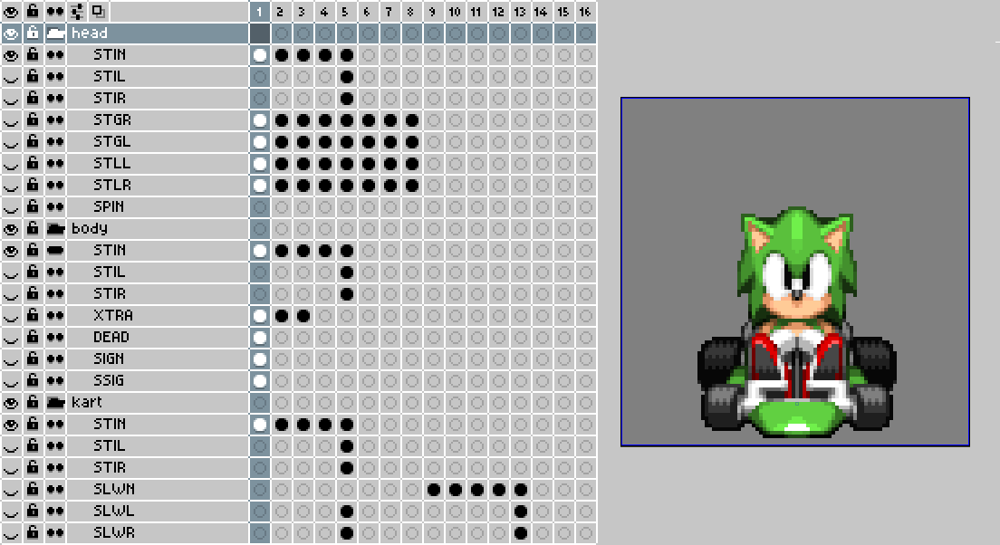

<h1 align="center">
	<a href="https://github.com/DragonDePlatino/Kart-Builder/releases/latest/download/kart-builder.zip">DOWNLOAD</a>
</h1>

# Kart Builder

An aseprite extension for drawing, previewing and exporting racers for Dr. Robotnik's Ring Racers.

## Prerequisites

- [Aseprite](https://www.aseprite.org/) (minimum version: v1.3-rc1)
- [7-Zip](https://www.7-zip.org/download.html)

7-Zip is used to create the `*.pk3` Quake III archive. Kart Builder will automatically find your 7-Zip installation and use it when exporting. For best results, install 7-Zip to one of the following locations:

* `C:\Program Files\7-Zip\7z.exe`
* `C:\Program Files(x86)\7-Zip\7z.exe`

Alternatively, make one of the following commands available in your system:

* `7z`
* `7za`

If 7-Zip is installed elsewhere and there is no `7z` or `7za` command in your console, add your 7-Zip installation folder to your PATH. Use [Windows Path Editor](https://rix0rrr.github.io/WindowsPathEditor/) on Windows or run `export PATH=$PATH:<your 7-zip directory>` on Linux.

## Installation

Grab the [latest release](https://github.com/DragonDePlatino/Kart-Builder/releases/latest/download/kart-builder.zip). Double-click on the `kart-builder.aseprite-extension` and Aseprite will install it. For alternate installation methods, consult the [aseprite documentation](https://www.aseprite.org/docs/extensions/).

## Exporting

Open `File > Export > Export Kart` to open the **Export Kart** dialog. Click the tabs at the top to change which category of `S_SKIN` properties you are editing. Click `[...]` in the lower-right to specify the output path. Click `Save` when you are done to output a `*.pk3` add-on to that location. See [EXPORT.md](docs/EXPORT.md) for a full explanation of each tab.

## Editing

Kart Builder uses a special `*.ase` file as your workspace. This file contains all of the layers, animations and `S_SKIN` properties of your add-on. Sounds should be `*.ogg` files kept next to your `*.ase` file or in a subfolder like `sounds/*.ogg`. An example template is provided in `examples/example.ase`.

### Layer Groups

Aseprite [layer groups](https://www.aseprite.org/docs/layer-group/) contain the layers of your racer, from top to bottom. The provided template comes with a `head`, `body` and `kart` layer group. You can have as many or few layer groups as you want. The `kart` layer group follows special rules for outputting frames outlined in [GRAPHICS.md](docs/GRAPHICS.md).

### Layers

The [layers](https://www.aseprite.org/docs/layers/) under each group correspond to the graphics of your racer. On export, Kart builder will merge the layers from bottom-to-top in the final graphic. Example: when outputting the `STIN` frames, Kart Builder will stack `kart > STIN`, `body > STIN` then `head > STIN` in that order. You are not limited to the layers provided in the template. Consult [GRAPHICS.md](docs/GRAPHICS.md) for a full list of usable layer names.

### Frames

The [frames](https://www.aseprite.org/docs/cel/) in each layer correspond to the different angles for each graphic. Frames 1-8 correspond to angles 1-8 of the Doom graphic. If frames 6-8 are missing for all layers, that graphic will be treated as symmetrical. See [ZDoom Wiki: Sprite](https://zdoom.org/wiki/Sprite) for a full explanation.

Frames 9-16 and onward define different animation frames for each graphic. 9-16 define all the angles for animation frame 2, 17-24 correspond to animation frame 3, etc. These are typically only used for the wheel flashing animation, but you may define custom heads and bodies as well.

### Slices

Aseprite [slices](https://www.aseprite.org/docs/slices/) are used to define the size and offset of your kart. You typically don't need to edit this unless you have resized your canvas.

### Fallbacks

If a layer is missing for a graphic, Kart Builder will try to find a fallback layer to render instead. For example, if you were missing frame `DRLN` for layer group `head`, then Kart Builder will try to resolve `DRLN > FSGR > SLGR > STGR > STIN` in that order.

If Kart Builder cannot find any fallbacks in the chain, it will skip outputting that layer group. This is common for the `XTRA`, `DEAD`, `SIGN` and `SIGN` layers. In the example template, these are only rendered in the `body` layer group and the rest of the layer groups are transparent. It is suggested you only define these in the `body` layer group.

## Tips

* Go to `Edit > Keyboard Shortcuts > Menus` and define a shortcut for `File > Export > Export Kart` for faster exporting. `Ctrl+Shift+E` is suggested.
* The canvas can be resized for larger or smaller sprites. Make sure to update your slice's pivot point if you do so!
* You can define more complicated animations than base game characters by specifying frames 9-16 for the `head` and `body` layers. An example would be a character with flowing hair or a different expression when moving quickly in `FSTN`.
* To make simple joke characters with no animations, you can delete every layer except `body > STIN` and just define those 5 frames.
* Kart Builder does not currently support some features like modded rivals or extra-large `DEADA0` frames (like Eggman). You can always edit the output `*.pk3` file in [SLADE](https://slade.mancubus.net/index.php?page=downloads) to make additional edits.
  * **WARNING**: Kart Builder will clear the contents of the `*.pk3` on every export. Any manual edits you made will be reverted on next export!

## Features
- [x] Full export for all sprites and sounds
- [x] Visual editor for `S_SKIN` properties
- [ ] Live preview for frames and palettes
- [ ] Raised wheel (Eggman) kart template
- [ ] Modded rivals support
- [ ] Multi-racer bundling
- [ ] SRB2K legacy export

## Support

Open an [issue](https://github.com/DragonDePlatino/Kart-Builder/issues) if you have any feature suggestion or bug report. Please include your `*.ase` file and a screenshot of any errors. Join the [Kart Krew](https://www.kartkrew.org/) Discord for any additional help using Kart Builder.

## Development

You can modify Kart Builder by editing the lua files in `%APPDATA%\Aseprite\extensions\kart-builder` after you install it. Make your modifications then hit `Ctrl+K` and go to `Extensions`. `Disable` then `Enable` the `Kart Builder` extension to reload the scripts and test your changes. Pull requests are welcome if you have any feature enhancements or bugfixes for the program!
