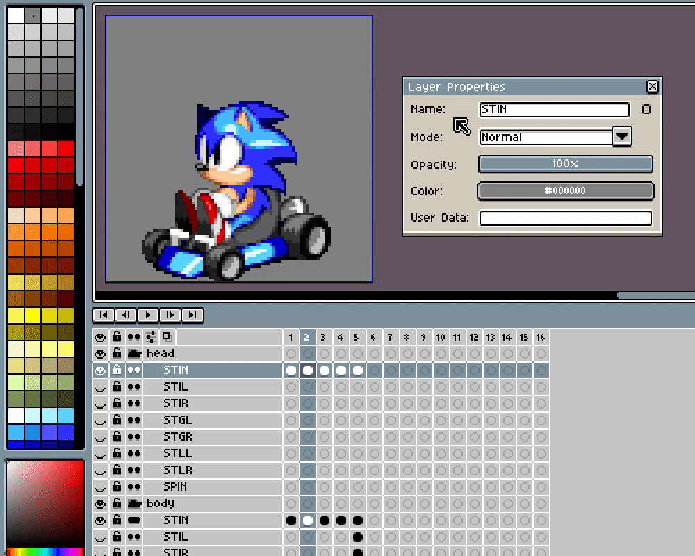

# Template

Kart Builder uses a special layer layout to organize your racer's frames and rotations. You can copy the provided `example/example.ase` for a pre-configured template.

## Layer Groups

Aseprite [layer groups](https://www.aseprite.org/docs/layer-group/) contain the layers of your racer, from top to bottom. The provided template comes with a `head`, `body` and `kart` layer group. You can have as many or few layer groups as you want. The `kart` layer group follows special rules for outputting frames outlined in [Graphics](GRAPHICS.md).

### Layers

The [layers](https://www.aseprite.org/docs/layers/) under each group correspond to the graphics of your racer. On export, Kart builder will merge the layers from bottom-to-top in the final graphic. Example: when outputting the `STIN` frames, Kart Builder will stack `kart > STIN`, `body > STIN` then `head > STIN` in that order. You are not limited to the layers provided in the template. Consult [Graphics](GRAPHICS.md) for a full list of usable layer names.

### Frames

The [frames](https://www.aseprite.org/docs/cel/) in each layer correspond to the different angles for each graphic. Frames 1-8 correspond to angles 1-8 of the Doom graphic. If frames 6-8 are missing for all layers, that graphic will be treated as symmetrical. See [ZDoom Wiki: Sprite](https://zdoom.org/wiki/Sprite) for a full explanation.

Frames 9-16 and onward define different animation frames for each graphic. 9-16 define all the angles for animation frame 2, 17-24 correspond to animation frame 3, etc. These are typically only used for the wheel flashing animation, but you may define custom heads and bodies as well.

### Slices

Aseprite [slices](https://www.aseprite.org/docs/slices/) are used to define the size and offset of your kart. You typically don't need to edit this unless you have resized your canvas.

### Fallbacks

If a layer is missing for a graphic, Kart Builder will try to find a fallback layer to render instead. For example, if you were missing layer `DRLN` for layer group `head`, then Kart Builder will try to resolve `DRLN > FSGR > SLGR > STGR > STIN` in that order. See [Graphics](GRAPHICS.md) for a full list of these fallbacks.

If Kart Builder cannot find any fallbacks in the chain, it will skip outputting that layer group. This is common for the `XTRA`, `DEAD`, `SIGN` and `SSIG` layers. In the example template, these are only rendered in the `body` layer group and the rest of the layer groups are transparent. It is suggested you only define these in the `body` layer group.

# Autofill

Autofill is a tool used to create new cels from existing ones. Most commonly it is used to paste and automatically offset `head` cels for glancing, turning and spinout sprites. Select one or more layers or cels, right-click a layer and select `Kart Builder > Autofill`.

After executing autofill rules you will need to manually adjust the offset of pasted heads to fit the body. This can be automated by specifying a list of autofill offsets for that layer beforehand. Right-click your layer > `Properties` > `User Data` and enter your list of offsets. These are a list of 8 comma-separated offsets in the format `x,y x,y x,y x,y x,y x,y x,y x,y`. Offsets can be negative (eg. `-4,0`) and the y-offset is optional (eg. `6` is equivalent to `6,0`).

Browse the layers in the provided `example.ase` file to see how to configure your autofill offsets. For a full list of supported autofill rules, see [Autofills](AUTOFILLS.md).

# Asymmetrize

If you have drawn angles 1-5 for a layer, you can auto-generate the flipped asymmetric frames for it. Select one or more layers or cels, right-click a layer and select `Kart Builder > Asymmetrize`.

# Ignore Cels

Sometimes, it is useful to have a cel as a visual reference but not emit it in the final output. To mark a cel as ignored, right-click it and go to `Cel Properties` > `User Data` > `Color` and set the cel to be red. Cels marked as red will be ignored in asymmetrify, autofill and the final export.

In this example, frames 6-8 of the `body` and `kart` have been ignored. These can be used to help position the head without making the `STIN` animation asymmetrical.

## Tips

* Go to `Edit > Keyboard Shortcuts > Menus` and define a shortcut for `File > Export > Export Kart` for faster exporting. `Ctrl+Shift+E` is suggested.
* The canvas can be resized for larger or smaller sprites. Make sure to update your slice's pivot point if you do so!
* You can define more complicated animations than base game characters by specifying frames 9-16 for the `head` and `body` layers. An example would be a character with flowing hair or a different expression when moving quickly in `FSTN`.
* To make simple joke characters with no animations, you can delete every layer except `body > STIN` and just define those 5 frames.
* Kart Builder does not currently support some features like modded rivals or extra-large `DEADA0` frames (like Eggman). You can always edit the output `*.pk3` file in [SLADE](https://slade.mancubus.net/index.php?page=downloads) to make additional edits.
  * **WARNING**: Kart Builder will clear the contents of the `*.pk3` on every export. Any manual edits you made will be reverted on next export!
