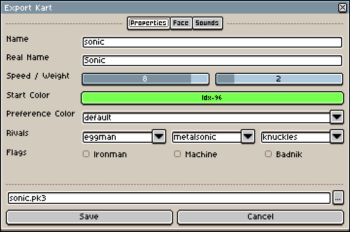
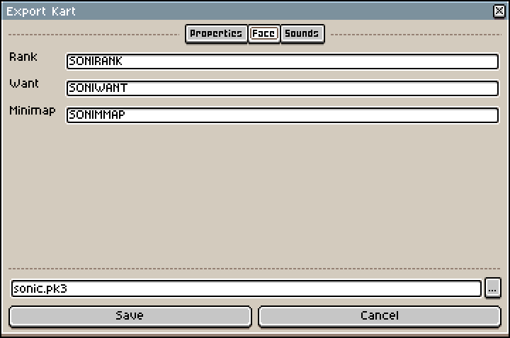
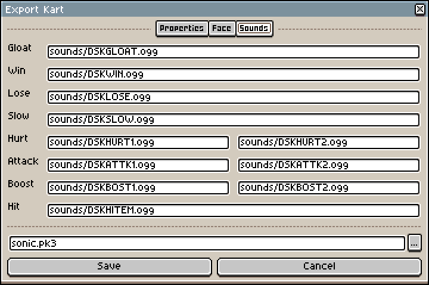

# Exporting

Following is an explanation of each tab in the **Export Kart** dialog.

## Properties

* **Name** - A unique, all-lowercase identifier for your racer.
* **Real Name** - A full, title case name for your character shown in menus and on the results screen.
* **Speed / Weight** - Your kart's stats. Consult the [Dr. Robotnik's Ring Racers Manual](https://www.kartkrew.org/rr-manual/manual/charsel/) for a full explanation.
* **Start Color** - The palette index used to recolor your racer. The 16 colors at this position will change in-game when you select different palettes. This must be an [indexed color](https://www.aseprite.org/docs/color-mode/#indexed) and can typically be left at 96.
  * Change this if you want to use the 16 greens at index 96 and sacrifice another 16 colors in the palette.
* **Preference Color** - The default palette your character displays in previews and swaps to when you hit `default` at character select. This should be the normal, canonical color of that character.
* **Rivals** - The pool of [rival racers](https://www.kartkrew.org/rr-manual/manual/gp/#rival-racer) that will selected when playing as your racer.
  * Kart Builder currently only supports 3 rivals from the basegame pool. Additional and modded rivals can be set by editing the output `*.pk3` in [SLADE](https://slade.mancubus.net/index.php?page=downloads).
* **Flags** - Additional behavior flags that apply to your character.
  * **Ironman** - The racer behaves like Heavy Magician, swapping to a random racer after each lap or being hit. They have special signpost behavior outlined in [Graphics](GRAPHICS.md).
  * **Machine** - The racer violently explodes on death and plays a different sound when emerging from water.
  * **Badnik** - The racer plays a popping sound and a Flicky emerges from them on death.

# Face

These can typically be left blank for modded characters. Each corresponds to different `XTRA` sprites.

* **Rank** - A small portrait used in the ranking HUD, player profiles and statistics screen. (`XTRAA0`)
* **Want** - A large portrait shown on the final results screen. (`XTRAB0`)
* **Minimap** - A tiny icon showing your character's position on the minimap. (`XTRAC0`)

# Sounds

Each sound is a path relative to your `*.ase` file. Sounds can be organized in a subfolder like `sounds/**`. Make sure to keep your sound files next to your `*.ase` sprite template if you move it!

* **Gloat** - A dramatic, echoing sound played when the racer uses Grow or Invincibility.
* **Win** - Played when the racer finishes in a high position.
* **Lose** - Said when the racer finishes in a low position.
* **Slow** - A quip shouted by your racer when they overtake another racer.
* **Hurt** - Two sounds randomly selected when your racer is hit.
* **Attack** - Two sounds randomly selected when your racer uses an offensive item.
* **Boost** - Two sounds randomly selected when your racer uses a speed-boosting item.
* **Hit** - A voice line said when your attack connects with another racer.
